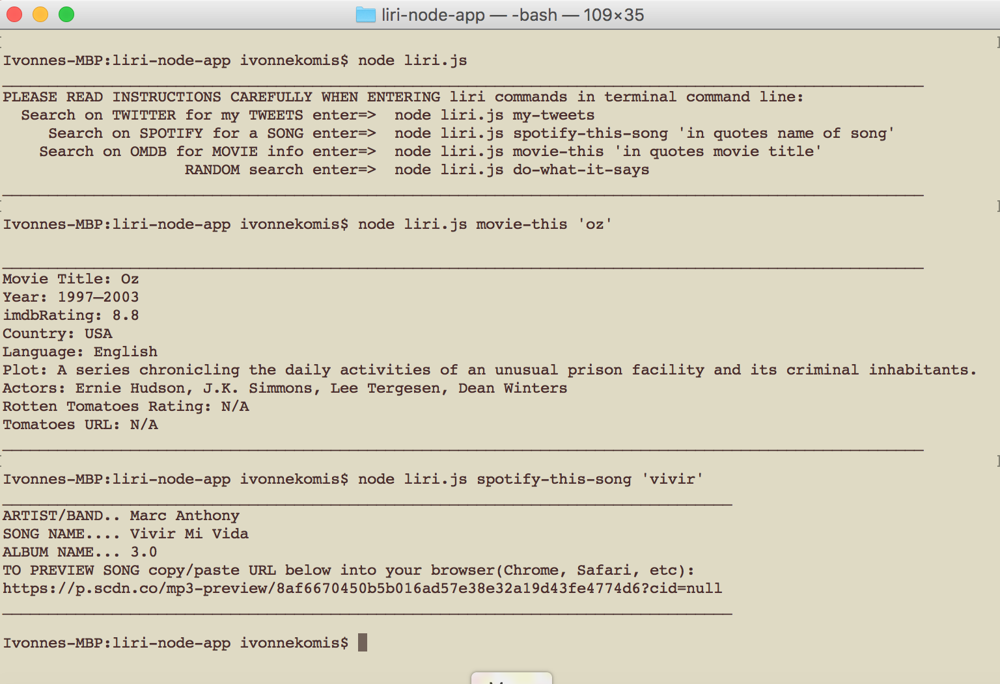

# Liri-node app. 
Liri is similar to Siri but Liri is an interactive text language interpretation and recognition.  
The app is used to send requests and get responses fromTwitter, Spotify and OMDB APIs. The code was written in Javascript but it is run in using the terminal command line. The app also reads a file random.txt that contains random requests and send response back with data from the API. It also logs all responses to a log.txt file using fs. Converted time using momentjs. Also added instructions when the requests at the command line are entered incorrectly it displays the instructions. Added the say npm package to have the computer speak when it pulls up the instructions. 
**To hear Instructions audio must be unmuted.**

## Screenshots:

## Technologies Used: 
- JavaScript 
- node.js 
- npm packages required: 
request, twitter, spotify, omdb,omdb-client, say, fs, moment

## Built With:
* Sublime Text

## Links: 	
- https://ivonnek.github.io/liri-node-app/
- https://github.com/IvonneK/liri-node-app

## Author: 
**Ivonne Komis** 
Member: Rutgers Coding Bootcamp
